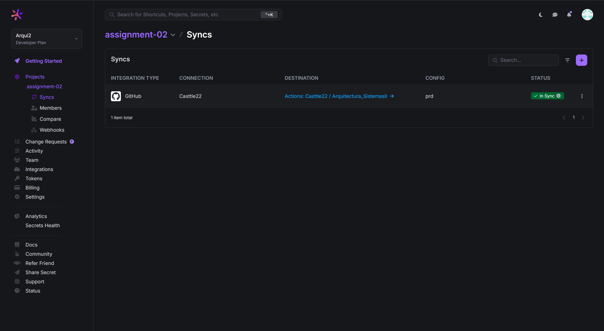
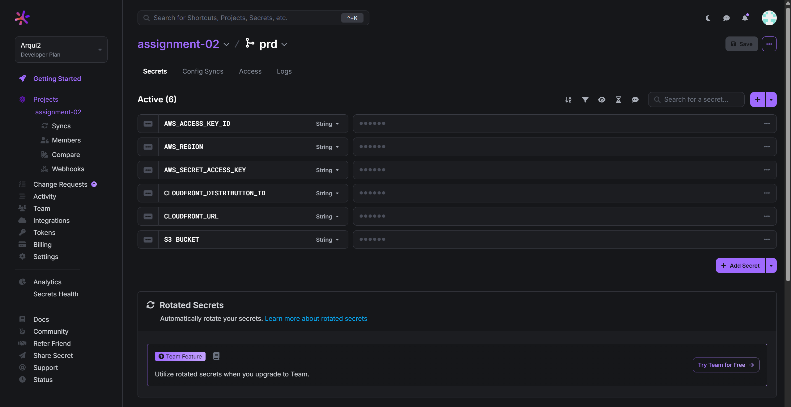
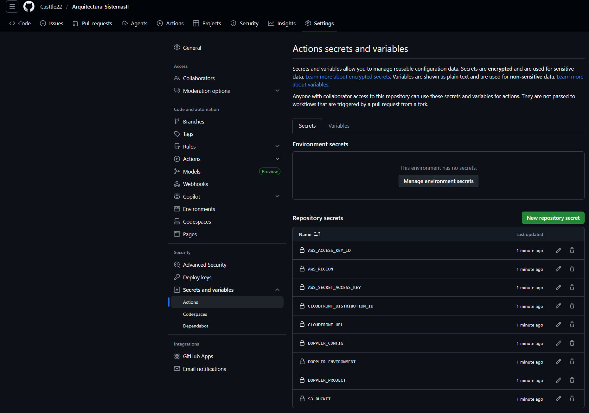
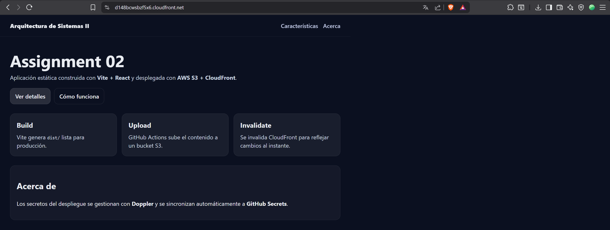

# Assignment 02 - Vite + React + AWS S3 + CloudFront + Doppler + GitHub Actions

Aplicación web estática construida con **Vite + React** y desplegada automáticamente a **AWS S3** detrás de un **CDN CloudFront**, usando **Doppler** para gestión de secretos sincronizados a **GitHub Secrets**.

## URL pública del CDN (CloudFront)
https://d148bcwsbzf5x6.cloudfront.net

## Evidencias requeridas

### 1) Doppler - Config Syncs (integración con GitHub)

### 2) Doppler - Variables (valores ocultos)

### 3) GitHub - Secrets (Actions)

### 4) Captura de la aplicación funcionando
